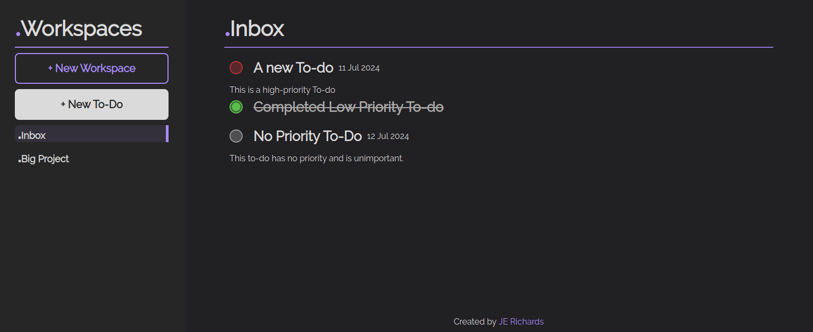

# To-do List App: An Intermediate JavaScript Project

## Table of Contents
1. [About](#about)
2. [Project Dependencies](#project-dependencies)
3. [The Web App](#the-web-app)
4. [Key Learnings](#key-learnings)
5. [Further Development](#further-development)
6. [Acknowledgements](#acknowledgements)

## About
This JavaScript project forms part of [The Odin Project JavaScript course.](https://www.theodinproject.com/lessons/node-path-javascript-todo-list). The purpose is to provide an opportunity for students to practice the content covered thus far in the course, as well as providing an opportunity to learn new topics independently - such as how to store data locally on a users machine.

This design of this app is inspired heavily by [Todoist](https://todoist.com/) and [Things](https://culturedcode.com/things/), whilst the default colour scheme is inspired by [Obsidian](https://obsidian.md/).

### App Features
- A modern user interface.
- The ability to create a new workspace to store related to-do items.
- The ability to edit existing workspaces and to-do items.
- The ability to move to-do items across workspaces.
- The ability to delete workspaces and to-do items.
- UI updates without the need to refresh the page.
- Workspaces and to-do items get stored locally on your device.

## Project Dependencies
The project dependencies are managed via npm and webpack and can be found in [package.json](package.json).

## The Web App
To use the app, please visit: https://je-richards.github.io/odin-todo-list/

## Key Learnings
### Clearly Plan and Scope a Project Upfront
Whilst I had done some initial planning prior to beginning the project, it lacked depth. By only producing such a high-level plan, it increased the time to complete the project. Not only did it add additional time to the project, but it also increased the project complexity and increased the difficulty of project maintenance.

 In future, it would be good to:
- Clearly define the project scope.
    - Clearly define what the requirements are for a MVP.
    - Put any non-essential features into a backlog that can be attempted if additional time is available.
- Plan out the code architecture beforehand.
- Break the project down into small, manageable, and actionable user stories.
    - Organise and track these on a project board.

### Nesting Buttons
When setting up the nav bar, I wanted each workspace to have a button to display its contents on the screen. But I also wanted to have another button (for workspace settings) appear when the user hovers over the workspace in the nav. 

The challenge here is that you can't nest a `<button>` inside of another `<button>` inside of HTML. To get around this issue, I found that you can use a `` inside the inner HTML of a `<button>` and apply an event listener to it. Through this, the `` can mimic the functionality of a button without actually *being* a button.

To ensure clicking the `` element doesn't trigger the `<button>` it's contained inside of, I needed to add a `event.stopPropagation()` to the span's click event.

### Squashing Multiple Commits
Towards the end of the project, I found that it's possible to squash multiple branch commits into a single commit when merging to main.

Prior to this, my workflow was to work in a branch, make multiple (often messy) commits as I go, and then merge everything back to main when the code in the branch is functional. But this led to a messy and bloated commit log for the project. By squashing multiple commits into a single one, it leads to a neater, more readable commit log.

### Accessing Local Storage
Until now, prior projects haven't needed to worry about storing data for future reference. As the purpose of a to-do list is to store items for future use, this project needed a way for workspaces and to-do's to persist across page loads and refreshes.

Enter `localStorage`. By utilising this, I was able to store a copy of each workspace onto the user's machine. Whilst this doesn't allow for a user's to-do's to persist across devices, it does allow them to persist across page loads and refreshes on a single device.

As I set up each workspace and to-do to be an instance of a custom class, some additional work was needed in order for them to be stored and retrieved. 

To solve this problem, I implemented a `serialize` and `deserialize` method onto the `Todo`, `Workspace`, and `WorkspaceManager` classes.

`serialize` converts the class item into a default JavaScript object, allowing `JSON.stringify()` to convert them to a string for storage. `deserialize` would take the string from local storage, use `JSON.parse()` to convert it back to a JavaScript object, and use the object keys to pass the stored values to the class constructors to reproduce the class items.

## Further Development
- [] Implement additional validation to prevent duplicate names for workspaces.
- [] Implement additional validation to prevent duplicate titles for to-do's within the same workspace.
- [] Disable the option to move a to-do if Inbox is the only workspace OR Implement functionality to create a new workspace when moving a to-do.
- [] Implement ways to order to-do's within the display:
    - [] By date created
    - [] By due date
    - [] User defined custom order
    - [] Alphabetically
- [] Implement a filter for to-do's and workspaces.
- [] Add sections to the default display based on the time between today and a to-do's due date.
- [] Implement a collapsable sidebar.
- [] Allow the user to dictate where a to-do is stored when creating a new to-do item.
- [] Add a reset button to each form.
- [] Dynamically change the due date font or background color depending on how close the due date is to today.
- [] Improve page responsiveness for different display sizes.
- [] Add display settings for mobile devices.
- [] Add a section on the display to separate incomplete and completed to-do items.

## Acknowledgements
### Fonts
**Montserrat:** This font is used for the periods used at the start of a workspace name. It can be found here - https://www.fontsquirrel.com/fonts/montserrat

**Raleway:** This is the default font used for all other text in the app. It can be found here - https://www.fontsquirrel.com/fonts/raleway

### Code
**Radio Button Styles:** The inspiration behind the custom styles applied to the radio buttons used to select a to-do's priority is the following article by Adam Butterfield - https://dev.to/adbutterfield/custom-styling-radio-buttons-the-modern-way-the-butterfield-way-emk

### SVG's
**Cog Icon:** The cog icon used for the workspace settings button can be found here - https://pictogrammers.com/library/mdi/icon/folder-cog-outline/

**Move File Icon:** The move file icon used for the move to-do button can be found here - https://pictogrammers.com/library/mdi/icon/file-move-outline/

**Trash Can Icon:** The trash can icon used for the delete to-do button can be found here - https://pictogrammers.com/library/mdi/icon/trash-can-outline/

**File Edit Icon:** The file edit icon used for the edit to-do button can be found here - https://pictogrammers.com/library/mdi/icon/file-edit-outline/